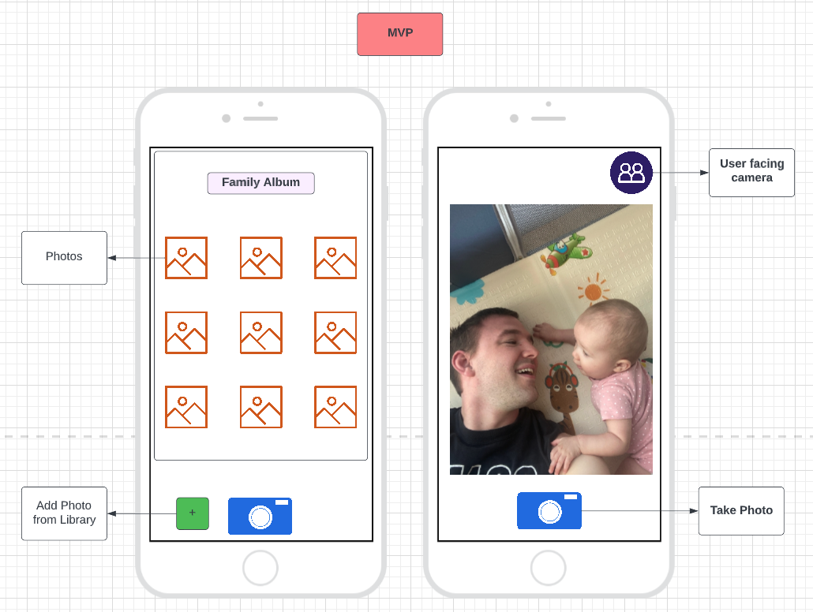

# Week 9

## Family Album via React Native

## To Install & Use

1. Copy the code and in your termial command line type gitclone- paste copied code.

2. npm i all the dependancies in the command line.

3. npm start 

* **Must have installed ExpoGo on your personal mobile phone** *

4. With your phone - scan the qr code that is generated with your camera.

5. With your phone - Give permision to application to utilize the applications' features.

## MVP

- App can take pictures.

- App can store pictures in front page

- App can add photos from personal library.

- App can switch to and from the forward facing camera & user facing camera

